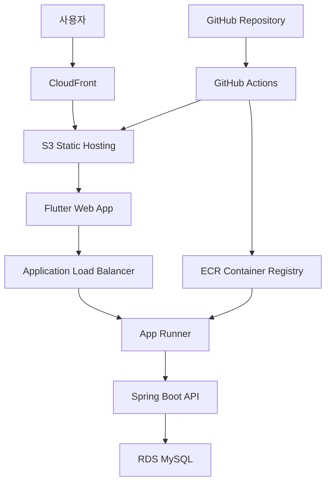

# 시스템 아키텍처

## 전체 아키텍처 개요



## 구성 요소

### 프론트엔드 (Flutter Web)
- **호스팅**: AWS S3 + CloudFront CDN
- **빌드**: GitHub Actions에서 자동 빌드
- **배포**: S3 버킷에 정적 파일 업로드 후 CloudFront 캐시 무효화

### 백엔드 (Spring Boot)
- **호스팅**: AWS App Runner
- **컨테이너**: Docker 이미지로 패키징
- **배포**: GitHub Actions → ECR → App Runner 자동 배포

### 데이터베이스 (MySQL)
- **호스팅**: AWS RDS MySQL 8.0
- **연결**: Spring Data JPA를 통한 ORM
- **보안**: VPC 내부 통신, SSL 연결

## 네트워크 구성

### VPC 설정
```
VPC: 10.0.0.0/16
├── Public Subnet 1: 10.0.1.0/24 (AZ-a)
├── Public Subnet 2: 10.0.2.0/24 (AZ-c)
├── Private Subnet 1: 10.0.11.0/24 (AZ-a)
└── Private Subnet 2: 10.0.12.0/24 (AZ-c)
```

### 보안 그룹
- **App Runner**: 포트 8080 (HTTP)
- **RDS**: 포트 3306 (MySQL, App Runner에서만 접근)
- **ALB**: 포트 80, 443 (HTTP/HTTPS)

## 배포 플로우

### 프론트엔드 배포
1. 코드 푸시 → GitHub
2. GitHub Actions 트리거
3. Flutter 웹 빌드 (`flutter build web`)
4. S3 버킷에 빌드 파일 업로드
5. CloudFront 캐시 무효화

### 백엔드 배포
1. 코드 푸시 → GitHub
2. GitHub Actions 트리거
3. Docker 이미지 빌드
4. ECR에 이미지 푸시
5. App Runner 서비스 업데이트

## 모니터링 및 로깅

### CloudWatch 설정
- App Runner 애플리케이션 로그
- RDS 성능 메트릭
- CloudFront 액세스 로그
- 알람 설정 (에러율, 응답시간)

### 헬스체크
- App Runner: `/actuator/health`
- RDS: 연결 상태 모니터링

## 보안 고려사항

### 인증 및 권한
- IAM 역할 기반 접근 제어
- App Runner 서비스 역할
- GitHub Actions용 OIDC 설정

### 데이터 보안
- RDS 암호화 (저장 시)
- SSL/TLS 통신 (전송 시)
- 환경 변수로 민감 정보 관리

### 네트워크 보안
- VPC 내부 통신
- 보안 그룹을 통한 포트 제한
- WAF 설정 (선택적)

## 비용 최적화

### 예상 비용 (월간)
- **App Runner**: ~$30-50 (최소 사양)
- **RDS**: ~$20-30 (db.t3.micro)
- **S3 + CloudFront**: ~$5-10
- **ECR**: ~$1-2
- **총합**: 약 $56-92/월

### 비용 절약 팁
1. RDS 예약 인스턴스 활용
2. CloudFront 캐싱 최적화
3. S3 Intelligent Tiering
4. 불필요한 로그 정리

## 확장성 고려사항

### 수평 확장
- App Runner 자동 스케일링 설정
- RDS Read Replica 추가 가능
- CloudFront 글로벌 배포

### 성능 최적화
- CDN 캐싱 전략
- 데이터베이스 인덱싱
- API 응답 캐싱
- 이미지 최적화