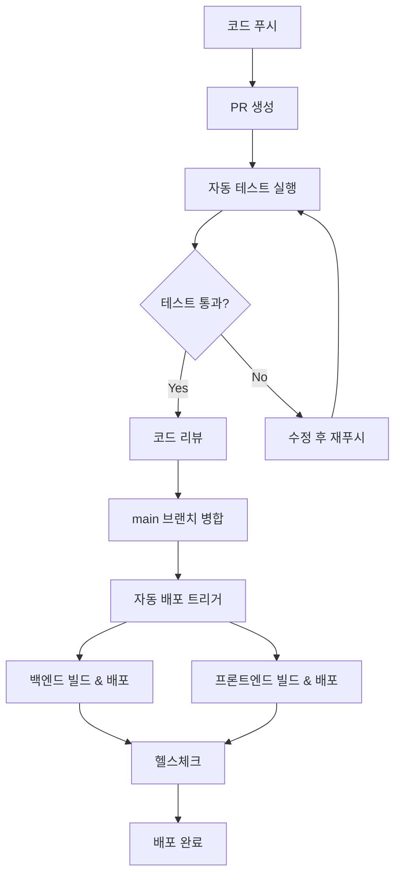

# CI/CD 파이프라인 설정 가이드

GitHub Actions를 사용한 자동 배포 파이프라인 설정 방법을 안내합니다.

## 1. GitHub Repository 설정

### Repository Secrets 설정
GitHub Repository → Settings → Secrets and variables → Actions에서 다음 시크릿을 설정하세요:

```bash
# AWS 인증
AWS_ROLE_TO_ASSUME=arn:aws:iam::123456789012:role/GitHubActionsRole

# AWS 리소스
APP_RUNNER_SERVICE_ARN=arn:aws:apprunner:ap-northeast-2:123456789012:service/aws-docker-backend/abcdefghijk
CLOUDFRONT_DISTRIBUTION_ID=ABCDEFGHIJK123
```

### 브랜치 보호 규칙 설정
Repository → Settings → Branches에서 `main` 브랜치에 대한 보호 규칙을 설정하세요:

- ✅ Require a pull request before merging
- ✅ Require status checks to pass before merging
- ✅ Require branches to be up to date before merging
- ✅ Include administrators

## 2. AWS IAM 설정

### GitHub Actions용 OIDC Identity Provider 생성

```bash
# OIDC Identity Provider 생성
aws iam create-open-id-connect-provider \
  --url https://token.actions.githubusercontent.com \
  --thumbprint-list 6938fd4d98bab03faadb97b34396831e3780aea1 \
  --client-id-list sts.amazonaws.com
```

### IAM 역할 생성

```json
{
  "Version": "2012-10-17",
  "Statement": [
    {
      "Effect": "Allow",
      "Principal": {
        "Federated": "arn:aws:iam::123456789012:oidc-provider/token.actions.githubusercontent.com"
      },
      "Action": "sts:AssumeRoleWithWebIdentity",
      "Condition": {
        "StringEquals": {
          "token.actions.githubusercontent.com:aud": "sts.amazonaws.com",
          "token.actions.githubusercontent.com:sub": "repo:YOUR_USERNAME/AWS_Docker:ref:refs/heads/main"
        }
      }
    }
  ]
}
```

### 권한 정책 연결

```json
{
  "Version": "2012-10-17",
  "Statement": [
    {
      "Effect": "Allow",
      "Action": [
        "ecr:GetAuthorizationToken",
        "ecr:BatchCheckLayerAvailability",
        "ecr:GetDownloadUrlForLayer",
        "ecr:BatchGetImage",
        "ecr:InitiateLayerUpload",
        "ecr:UploadLayerPart",
        "ecr:CompleteLayerUpload",
        "ecr:PutImage"
      ],
      "Resource": "*"
    },
    {
      "Effect": "Allow",
      "Action": [
        "apprunner:StartDeployment",
        "apprunner:DescribeService"
      ],
      "Resource": "arn:aws:apprunner:ap-northeast-2:123456789012:service/aws-docker-backend/*"
    },
    {
      "Effect": "Allow",
      "Action": [
        "s3:PutObject",
        "s3:PutObjectAcl",
        "s3:GetObject",
        "s3:DeleteObject",
        "s3:ListBucket"
      ],
      "Resource": [
        "arn:aws:s3:::aws-docker-frontend-bucket",
        "arn:aws:s3:::aws-docker-frontend-bucket/*"
      ]
    },
    {
      "Effect": "Allow",
      "Action": [
        "cloudfront:CreateInvalidation",
        "cloudfront:GetInvalidation",
        "cloudfront:GetDistribution"
      ],
      "Resource": "arn:aws:cloudfront::123456789012:distribution/ABCDEFGHIJK123"
    }
  ]
}
```

## 3. 워크플로우 설명

### Backend Deploy Workflow

`.github/workflows/backend-deploy.yml`

**트리거 조건:**
- `main` 브랜치에 `backend/` 디렉토리 변경사항 푸시
- Pull Request (테스트만 실행)

**주요 단계:**
1. **테스트 실행**: Java 17 환경에서 단위 테스트 실행
2. **Docker 빌드**: 백엔드 애플리케이션을 Docker 이미지로 빌드
3. **ECR 푸시**: Docker 이미지를 Amazon ECR에 푸시
4. **App Runner 배포**: App Runner 서비스 자동 업데이트
5. **헬스체크**: 배포된 서비스의 상태 확인

### Frontend Deploy Workflow

`.github/workflows/frontend-deploy.yml`

**트리거 조건:**
- `main` 브랜치에 `frontend/` 디렉토리 변경사항 푸시
- Pull Request (테스트만 실행)

**주요 단계:**
1. **테스트 실행**: Flutter 코드 분석 및 테스트 실행
2. **환경 설정**: 백엔드 URL을 동적으로 가져와서 .env 파일 생성
3. **Flutter 빌드**: 프로덕션용 웹 빌드 실행
4. **S3 배포**: 빌드된 파일을 S3 버킷에 업로드
5. **CloudFront 무효화**: CDN 캐시 갱신
6. **E2E 테스트**: 프론트엔드-백엔드 연동 테스트

### Pull Request Check Workflow

`.github/workflows/pr-check.yml`

**트리거 조건:**
- `main` 또는 `develop` 브랜치로의 Pull Request

**주요 기능:**
1. **변경 감지**: 백엔드/프론트엔드 변경사항 자동 감지
2. **코드 품질 검사**: 코드 스타일, 보안 스캔 실행
3. **테스트 커버리지**: 테스트 커버리지 리포트 생성
4. **빌드 테스트**: Docker 빌드 가능성 확인
5. **PR 코멘트**: 자동화된 리뷰 결과 코멘트

## 4. 배포 플로우

### 정상적인 배포 과정



### 백엔드 배포 플로우

1. **코드 변경 감지** → `backend/` 디렉토리 변경사항
2. **테스트 실행** → JUnit 테스트, 코드 커버리지
3. **Docker 빌드** → 멀티스테이지 빌드로 최적화
4. **ECR 푸시** → 태그 관리 (latest, git SHA)
5. **App Runner 배포** → 자동 롤링 업데이트
6. **헬스체크** → `/api/health` 엔드포인트 확인

### 프론트엔드 배포 플로우

1. **코드 변경 감지** → `frontend/` 디렉토리 변경사항
2. **테스트 실행** → Flutter 분석, 단위 테스트
3. **환경 설정** → 백엔드 URL 동적 설정
4. **Flutter 빌드** → 프로덕션 최적화 빌드
5. **S3 업로드** → 캐시 설정과 함께 업로드
6. **CloudFront 무효화** → CDN 캐시 갱신

## 5. 모니터링 및 알림

### GitHub Actions 알림 설정

```yaml
# Slack 알림 예시
- name: Notify Slack
  if: always()
  uses: 8398a7/action-slack@v3
  with:
    status: ${{ job.status }}
    webhook_url: ${{ secrets.SLACK_WEBHOOK }}
```

### 배포 실패 시 대응

1. **로그 확인**: GitHub Actions 로그에서 실패 원인 파악
2. **롤백**: 이전 버전으로 수동 롤백
3. **수정 후 재배포**: 문제 수정 후 다시 푸시

## 6. 고급 설정

### 환경별 배포

```yaml
# 스테이징 환경 배포
- name: Deploy to Staging
  if: github.ref == 'refs/heads/develop'
  # 스테이징 배포 로직

# 프로덕션 환경 배포  
- name: Deploy to Production
  if: github.ref == 'refs/heads/main'
  # 프로덕션 배포 로직
```

### 병렬 빌드 최적화

```yaml
strategy:
  matrix:
    node-version: [18, 20]
    java-version: [17, 21]
```

### 시크릿 로테이션

주기적으로 AWS Access Key와 기타 시크릿을 갱신하세요:

1. 새로운 IAM 사용자 생성
2. GitHub Secrets 업데이트
3. 이전 키 비활성화

## 7. 문제 해결

### 일반적인 이슈

1. **권한 오류**
   ```bash
   Error: User is not authorized to perform action
   ```
   → IAM 권한 확인

2. **빌드 실패**
   ```bash
   Error: Failed to build Docker image
   ```
   → Dockerfile 및 의존성 확인

3. **배포 타임아웃**
   ```bash
   Error: Deployment timeout
   ```
   → App Runner 리소스 설정 확인

### 디버깅 팁

```yaml
# 디버그 모드 활성화
- name: Enable Debug Logging
  run: echo "ACTIONS_STEP_DEBUG=true" >> $GITHUB_ENV
```

## 8. 보안 모범 사례

1. **시크릿 관리**: GitHub Secrets 사용, 코드에 하드코딩 금지
2. **권한 최소화**: 필요한 최소 권한만 부여
3. **브랜치 보호**: main 브랜치 직접 푸시 방지
4. **코드 스캔**: 보안 취약점 자동 스캔
5. **의존성 관리**: 정기적인 의존성 업데이트

이 가이드를 따라 설정하면 안전하고 효율적인 CI/CD 파이프라인을 구축할 수 있습니다.